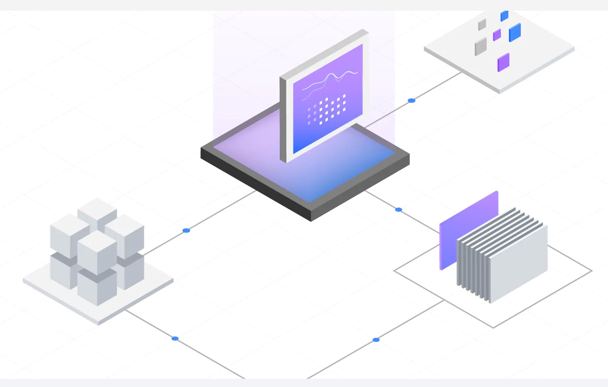

## Demo for All Things Open 2021

## Slides
You can download at [bit.ly/ato2021-nodejs](https://bit.ly/ato2021-nodejs)
## Prerequisites

See [DEVOPS.md](.devops/DEVOPS.md) to setup minikube


## Knative

start app in cluster for dev and debug
```
npm run dev
```

Open knative service on the browser
```
open http://localhost:8080
```

## (Optional) Deploy the App on IBM Code Engine
Follow the tutorial [Building your first container image from source code](https://cloud.ibm.com/docs/codeengine?topic=codeengine-getting-started#build-image-gs)


## (Optional) Kubernetes

start app in cluster for dev
```
npm run kube-dev
```


start app in cluster for debugging
```
npm run kube-debug
```

To find more options run `npm run`


